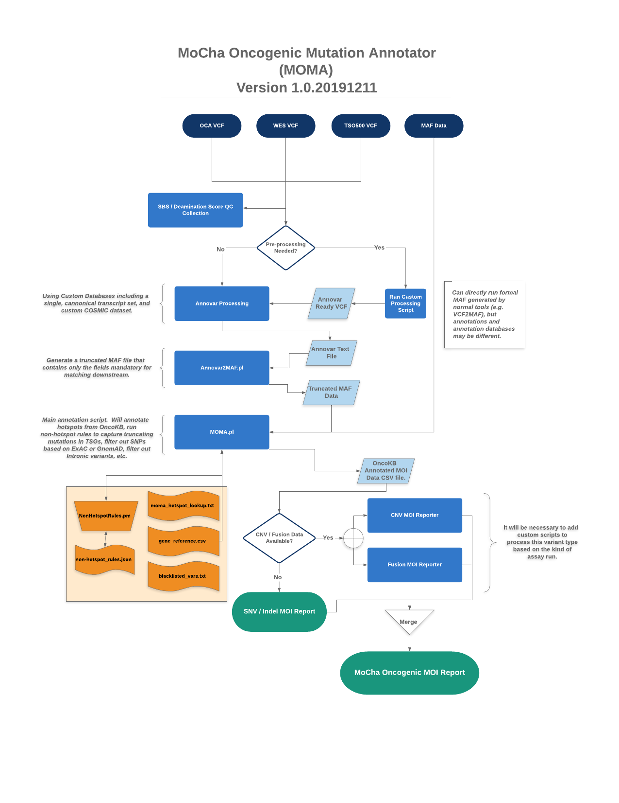

############
Introduction
############

The MoCha Oncogenic MOI Annotator (MOMA) utility is a sequencing platform 
agnostic tool used to annotate variants from a NGS sequencing assay and classify 
the variants as Mutations of Interest (MOIs) or Variants of Unknown Significance
(VuSes). These classifications are based on annotation data from `Annovar`_, which 
will indicate a variant's location, functional effect, population frequency 
information, etc., and mapping them to OncoKB_, where the variant's
*Oncogenicity* and *Effect* can be determined.

In addition, simple filtering is performed on the output data to remove variants
that are not clinically relevant. We remove variants that are above a set 
population frequency as determined from GnomAD_, ExAC, and 1000G_, as well as 
non-coding variants (i.e. intronic) and synonymous variants. The remaining calls, 
then, are mapped to OncoKB and the variant's Oncogenicity and Oncogenic Effect
annotation is added to the variant call if there is a match.

MOMA is designed to be compatible with VCF files from all NGS platforms, either
natively, or with the addition of a simple helper script to modify the input to
be compatible with the annotation pipeline.  MOMA can also run starting from a
MAF file.  In fact, the first steps of the MOMA pipeline when starting from a
VCF file, is to annotate the data and generate a MAF file that the tool will use
for downstream processing.  As shown below, the spirit of the tool is to be able
to accomodate any kind of data, using helper scripts to stage the data in a way
that can be easily processed through the rest of the tool

.. index::
    MOMA; Workflow diagram

.. _moma-workflow:

*************
MOMA Workflow
*************

Each MOMA run should start with a VCF file from the assay platform of choice.
From that VCF, a Single Base Substitution 6 (SBS-6) matrix is generated and the
number of base changes corresponding to those 6 categories is tallied, along
with computing the number of transitions, transversions, transition to
transversion ratio (Ts/Tv) and deamination score.  See more about this data in
the :ref:`sbs6-output` for details.

If your pipeline outputs copy number variants (CNVs) and / or translocations
(gene fusions), MOMA can possibly handle that as well.  As of this version, MOMA
will handle these data natively for Oncomine Comprehensive Assay (OCA) and 
TruSight Oncology 500 ctDNA.  As these kinds of data are quite varied in their
reporting format, helper scripts will most certainly need to be written to
handle those outputs.  However, once the data is formatted appropriately with a
helper script, the output can be annotated with OncoKB and merged into the final
dataset just like the above mentioned platforms.

.. note::
    In order to process these extra variant types, additional input files may be
    required.  See :ref:`moma-output` for details.

Typical output from a MOMA run will be a final MOMA Report as a CSV file, as
well as a directory of some other informative output files.  The table below
indicates these files and their purpose.

.. index:: 
     MOMA; output files

.. tabularcolumns:: |p{4cm}|p{11cm}|

.. table:: **Typical MOMA Output Files**
    :class: longtable

    +-------------------------+----------------------------------------------------------+
    | **Output File**         | **Description**                                          |
    +=========================+==========================================================+
    | .log                    | Log file from the pipline, containing useful information |
    |                         | about the run, version numbers for resource files,       |
    |                         | information about some variants that have been filtered  |
    |                         | out, and whatnot.                                        |
    +-------------------------+----------------------------------------------------------+
    | .annovar.txt            | Text file output from Annovar that will be used to       |
    |                         | generate a MAF file.                                     |
    +-------------------------+----------------------------------------------------------+
    | .annovar.vcf            | The VCF version of the Annovar output. Not currently     |
    |                         | used for anything.                                       |
    +-------------------------+----------------------------------------------------------+
    | .maf                    | MAF file of annotated variants. This file is somewhat    |
    |                         | truncated from the full set of MAF fields, but can still |
    |                         | be parsed by many conventional MAF parsing tools.        |
    +-------------------------+----------------------------------------------------------+
    | .moma_report_<date>.csv | The final MOMA report.                                   |
    +-------------------------+----------------------------------------------------------+
    | .sbs_metrics.csv        | Data for the Single Base Substitution 6 (SBS-6)          |
    |                         | matrix as determined from the VCF. Useful in             |
    |                         | determining if there is deamination artifacts            |
    |                         | for example.                                             |
    +-------------------------+----------------------------------------------------------+

More details on the expected output from MOMA can be found in 
the :ref:`moma-output` section.

.. index:: Installation

############
Installation
############
As this package is a collection of Perl and Python scripts, installation is
simple, and requirements are few.  The package can be installed on any \*nix
system with at least 8GB RAM for smaller analyses (e.g. Oncomine Comprehensive
Assay) and maybe up to 32GB of RAM for larger, WES analyses.  

.. index:: Installation; Requirements

************
Requirements
************
The following packages and tools are required to run this plugin:

    * Python3
    * Perl v5.26+
    * Annovar
    * vcftools
    * samtools
    * bedtools

Be sure that these elements have been properly installed and are availble in
your ``$PATH``.  

.. index:: Installation; Scripting Languages

Scripting Languages
===================
All of the code base for this utility is written in either BASH, Perl or Python3.
You can probably use whichever system Perl is available to you (tested 5.26.x to 
5.31.x) as there are no major, specialized language requirements (see below for
module requirements). Please be sure to have Python3 installed as it is required 
for MOMA, and Python 2.7 will not work. As of this writing  Python 2.7 is slated
to be deprecated by the end of 2020, and its continued use is discouraged.

Additionally, there are some Python and Perl libraries that should be installed
as they are not typically part of the standard installation:

.. tabularcolumns:: |p{1.5cm}|p{6cm}|

.. index::
    Installation; Extra modules

.. table:: **Additional Required Modules for Each Scripting Language**
   :class: longtable

   +--------------+-----------------------+
   | **Language** | **Package / Library** |
   +==============+=======================+
   | Perl         | Data::Dump            |
   |              |                       |
   |              | Text::CSV             |
   |              |                       |
   |              | Sort::Versions        |
   |              |                       |
   |              | Log::Log4perl         |
   +--------------+-----------------------+
   | Python3      | pysam                 |
   |              |                       |
   |              | natsort               |
   +--------------+-----------------------+

.. note::
    The python `natsort` library is required as well, but to help control
    versioning, a version of this library has been included in the package.

These libraries can be installed using the typical tools / methods normally used
to install these components (e.g. ``cpan`` or its more streamlined cousin ``cpanm``
for Perl and ``pip3`` for Python3). Be sure that the modules can be found in 
your ``$PERLLIB`` / ``$PYTHONPATH``, and can be loaded.

.. index:: Annovar

Annovar Variant Annotation Package
==================================
In order to determine the coding sequence change, protein change, variant
location, population frequency value, etc. for each variant in the VCF file, the
data need to be annotated.  Annovar was chosen due to its flexibility
(the tool uses databases for this task, which can easily be modified and created),
speed, and lighter footprint / resources. There certainly are other tools that
can be used for the same task (e.g. `VEP`_), and we are not endorsing one tool
as being better than any other.  For the purposes of MOMA, however, we decided
that Annovar would be a good resource for the annotation component during the
development of the tool.

In order to ensure that the data are always the same coming from the pipeline,
and since Annovar can not be distributed with this package, it must be installed
and moved into this package as instructed below. We do not recommend using any 
other system Annovar at this time, and there has been a check set up to ensure
that a local copy of Annovar has been copied into the package.

.. index::
    pair: Annovar; Installation

Annovar Package Installation
----------------------------
As indicated above, Annovar is employed by this plugin to do variant annotation,
and as such needs to be downloaded and installed along with some databases.  You
can find the Annovar documentation and installation instructions `here
<http://annovar.openbioinformatics.org/en/latest/user-guide/download/>`_

Once downloaded, the Annovar installation should be put into the ``lib`` dir in
the MOMA package without the database files (essentially just the Annovar Perl 
scripts).  We'll store the database files in a different location in the next
step.

Annovar Database Installation
-----------------------------
We use some of the publicly distributed Annovar libraries for this package,
along with some custom ones. Since they are far too large to keep within this
Github repo, they need to be obtained from a different resource.

.. todo::
    I need to figure out a way to distribute these database files!  Maybe I can
    get a tarball or something of these that can be used?

.. index:: 
   pair: Annovar; Annovar databases 
   pair: Installation; Annovar databases
   
The following are the databases used by this plugin:

    **Required Annovar Databases**

        - **Custom Databases**

          * hg19_trunc_refGene, hg19_trunc_refGeneMrna (custom refgene database).
          * hg19_cosmic89_noEnst (custom COSMICv89 database)

        - **Default Databases**

          * hg19_knownGene
          * hg19_avsnp142
          * hg19_dbnsfp35a
          * hg19_clinvar_20190305
          * hg19_popfreq_all_20150413
          * hg19_gnomad_exome

Since the required Annovar databases total more than 40 GB in size they can not
be included in this repository.  Instead, you must download the databases
following the instructions in the `Annovar Documentation 
<http://annovar.openbioinformatics.org/en/latest/user-guide/download/>`_  Once 
the files are downloaded, they should be decompressed and stored in a directory
called ``annovar_db`` in the ``resources`` dir of the package (full path: 
``mocha_oncogenic_moi_annotator/resource/annovar_db/``).

The custom databases, as indicated above, can be obtained from here:

.. todo::
   Maybe I can put these on S3 for download?

.. index:: 
    MOMA; Resource files
    hg19
    human reference
    GRCh37

Human Reference hg19
--------------------
For some steps of the pipeline a human reference hg19 (GRCh37) FASTA file is
required. This file can be obtained from the 
`UCSC Golden Path Repository <https://hgdownload.soe.ucsc.edu/goldenPath/hg19/bigZips/>`_ 
Once downloaded, place this file in the ``resources`` directory.  To conserve 
space, this file should be gzipped, and it will be indexed during the first run. 

.. index::
    MOMA; Setup

***************
Setting up MOMA
***************

.. todo::
    Write a setup script that can help automate all of this.

Setting up MOMA is as simple as getting the package, getting Annovar, and
getting the necessary resource files (i.e. Annovar database and human reference
files), and placing all in the correct location.

      1. Clone the MOMA repository from
         `the MOMA github repository <https://github.com/drmrgd/moma.git>`_.

      2. Download the latest version of Annovar from the 
         `Annovar source <https://annovar.openbioinformatics.org/en/latest/user-guide/download/>`_
         
      3. Create a directory called ``annovar`` in the ``lib`` dir in the package
         root. The full path should be: ::

             mocha_oncogenic_moi_annotator/lib/annovar/

      4. Move the Annovar perl scripts from Step 3 into this new directory.
         You'll typically see 6 scripts:

             1. ``annotate_variation.pl``
             2. ``coding_change.pl``
             3. ``convert2annovar.pl``
             4. ``retrieve_seq_from_fasta.pl``
             5. ``table_annovar.pl``
             6. ``variants_reduction.pl``

         We don't need all of the annovar scripts for this package, but there's
         no reason to exclude any for now. 

      5. Get the human reference hg19 fasta.gz file and place into the
         ``resources`` dir within the package root.

      6. Create a new directory in ``resources`` called ``annovar``, get the
         Annovar database files, and place them into the new directory.  

.. index::
    MOMA; Package structure

In the end, you should have a directory tree that looks like this:

.. code-block:: none
   :caption: **Typical MOMA Package Structure**

    lib
    ├── annovar
    │   ├── annotate_variation.pl
    │   ├── coding_change.pl
    │   ├── convert2annovar.pl
    │   ├── retrieve_seq_from_fasta.pl
    │   ├── table_annovar.pl
    │   └── variants_reduction.pl
    ├── bin
    │   └── natsort
    ├── logger.py
    ├── natsort
    │   ├── compat
    │   ├── __init__.py
    │   ├── __main__.py
    │   ├── natsort.py
    │   ├── ns_enum.py
    │   ├── __pycache__
    │   ├── unicode_numbers.py
    │   ├── unicode_numeric_hex.py
    │   └── utils.py
    ├── NonHotspotRules.pm
    ├── __pycache__
    │   ├── logger.cpython-36.pyc
    │   ├── logger.cpython-37.pyc
    │   ├── utils.cpython-36.pyc
    │   └── utils.cpython-37.pyc
    └── utils.py
    LICENSE.txt
    MoCha_Oncogenic_Mutation_Annotator.py
    moma_plugin.py
    resource
    ├── annovar_db
    │   ├── hg19_avsnp142.txt
    │   ├── hg19_avsnp142.txt.idx
    │   ├── hg19_clinvar_20190305.txt
    │   ├── hg19_clinvar_20190305.txt.idx
    │   ├── hg19_cosmic89_noEnst.txt
    │   ├── hg19_cytoBand.txt
    │   ├── hg19_dbnsfp35a.txt
    │   ├── hg19_dbnsfp35a.txt.idx
    │   ├── hg19_gnomad_exome.txt
    │   ├── hg19_gnomad_exome.txt.idx
    │   ├── hg19_knownGene.txt
    │   ├── hg19_popfreq_all_20150413.txt
    │   ├── hg19_popfreq_all_20150413.txt.idx
    │   ├── hg19_trunc_refGeneMrna.fa
    │   └── hg19_trunc_refGene.txt
    ├── blacklisted_vars.txt
    ├── count.txt
    ├── gene_reference.csv
    ├── hg19.fasta.gz
    ├── hg19.fasta.gz.fai
    ├── hg19.fasta.gz.gzi
    ├── mocha_tso500_ctdna_hotspots_v1.072018.bed
    ├── moma_cnv_lookup.tsv
    ├── moma_fusion_genes.tsv
    ├── moma_hotspot_lookup.txt
    └── non-hotspot_rules.json
    run_moma_pipeline.py
    scripts
    ├── annovar2maf.pl
    ├── annovar_wrapper.sh
    ├── calc_tmb.pl
    ├── calc_tstv_deam.py
    ├── collate_moma_reports.pl
    ├── get_cnvs.pl
    ├── get_fusions.pl
    ├── get_var_counts_from_moma_results.pl
    ├── moma2rave.py
    ├── moma.pl
    ├── simplify_vcf.pl
    ├── tso500_cnvs.pl
    ├── tso500_fusions.pl
    └── usage.sh
    templates
    ├── barcode_block.html
    ├── barcode_summary.html
    └── progress_block.html
    test
    ├── gen_tests
    │   ├── 19-31014-002-Q_cfNA_rep1.clean.maf
    │   ├── 19-32096-004-SCRN_cfTNA_rep1.clean.annotated.filtered.maf
    │   ├── H7T7_cfTNA_rep3.clean.annotated.filtered.maf
    │   ├── H7T7_cfTNA_rep3.clean.maf
    │   ├── nhs_tests.json
    │   ├── nhs_test.truncmaf
    │   ├── sample.truncmaf
    │   └── test_nonhs_rules_module.pl
    ├── ocav3
    │   ├── 0CFDXX_IonXpress_079.vcf
    │   └── oca.vcf
    ├── tso500
    │   ├── Horizon_2-000_rep1.cnv.fc.txt
    │   ├── Horizon_2-000_rep1.fusion.txt
    │   ├── Horizon_2-000_rep1.vcf
    │   ├── Lovo_nuc.vcf
    │   ├── npDNA121_MS_rep1.vcf
    │   ├── poolcf88_RDH_rep1.vcf
    │   ├── W313718105511_cfNA.vcf
    │   ├── W313718105515_cfNA.vcf
    │   └── W313718105516_cfNA.vcf
    └── wes
        ├── 114434.consensus.vcf
        └── 128128~338-R~L42~WES.merged.vcf
    _version.py

.. note::
    There are some files and scripts in this package that are not currently
    used, but are intended for use in Ion Torrent Plugins downstream. They can
    be ignored for now.

.. index::
    Installation; Testing

*************
Running Tests
*************
Included in the package is a set of test VCF files that can be run through MOMA.
You can find these located in the ``test`` directory within the package. 

.. todo::
    Set up a simple test harness script to run all tests at once and compare the
    data.

You can simply attempt to process each platform specific VCF file through MOMA
following the usage instructions in the :ref:`moma-tutorial` section. If these 
tests can complete successfully, you have a fully working instance, ready to 
process samples.

.. _Annovar: https://doc-openbio.readthedocs.io/projects/annovar/en/latest/
.. _OncoKB: https://www.oncokb.org/
.. _GnomAD: https://gnomad.broadinstitute.org/
.. _1000G: https://www.internationalgenome.org/1000-genomes-browsers/
.. _VEP: https://useast.ensembl.org/info/docs/tools/vep/index.html
